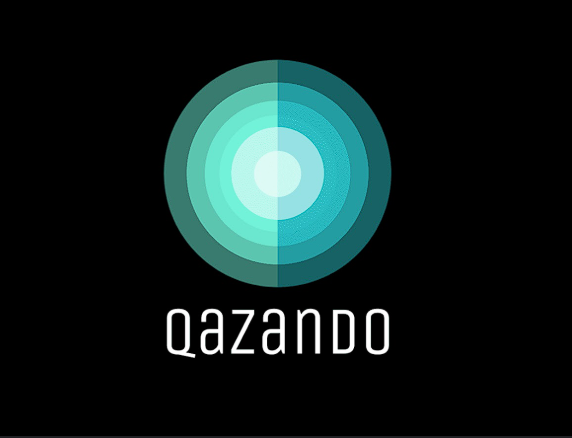
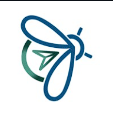
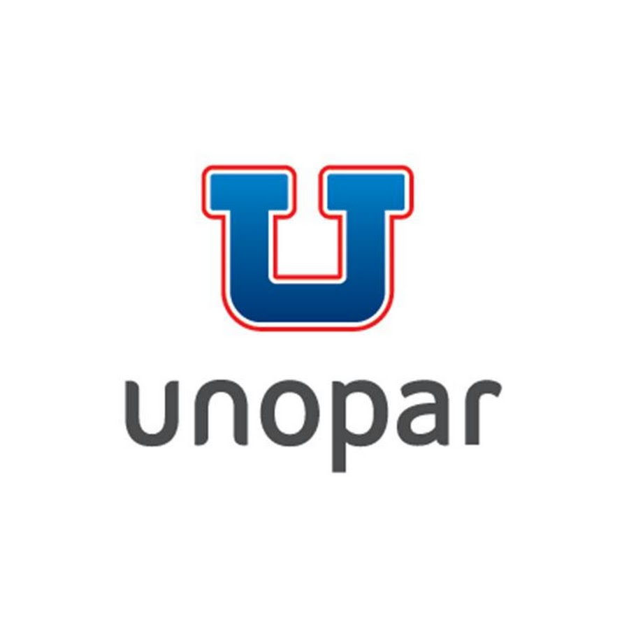

  <h2>
    <a href="https://git.io/typing-svg">
      
    </a>
  </h2> 

Analista de Qualidade de Software em transição de carreira, com foco em testes **funcionais, exploratórios e automatizados**.  
Experiência em atendimento e liderança de suporte técnico, fortalecendo minha visão voltada para **detalhes, usabilidade** e **experiência do usuário**.  

---

## 🎓 Formações

<table>
  <tr>
    <td align="center"></td>
    <td>
      <b>MasterClass - Qazando</b> 
      Outubro 2025 - Previsão até 2026 
      Competências: Testes Manuais e Gestão de Testes, Gherkin, Ferramentas e Frameworks de Automação, Testes de API (Cypress, Postman, Rest Assured, Playwright, Robot Framework), Testes Web (Cypress, Selenium, CodeceptJS) Testes Mobile (Appium, Maestro, Espresso, XCUITest), Testes de Performance (k6, JMeter, Wiremock), Git, DevOps e Boas Práticas de QA.
    </td>
  <tr>
    <td align="center"></td>
    <td>
      <b>Guardião da Qualidade - LumeStack</b> 
      Junho 2025 - Previsão até 2026 
      Competências: Testes de Software, Processos Ágeis, Automação de Testes com Cypress, Automação de API com Postman, CI com GitHub Actions, Automação Mobile com JavaScript, Banco de Dados.
    </td>
  </tr>
  <tr>
    <td align="center"></td>
    <td>
      <b>Pós-graduação em Engenharia de Produção - Descomplica</b> 
      Março 2022 - até Março 2023
    </td>
  </tr>
  <tr>
    <td align="center"></td>
    <td>
      <b>Tecnólogo em Processos Gerenciais - Unopar</b> 
      Junho 2015 - até Dezembro 2018
    </td>
  </tr>
  

</table>

---

## 📂 Projetos

  

- 💥 [**Cypress Heroes**](https://github.com/ThalikParente/qa-projeto-cypress-heroes)  
  Projeto desenvolvido para testar a aplicação oficial Cypress Heroes, abordando cenários de autenticação, criação e gerenciamento de heróis. Inclui testes funcionais, negativos e de interface, aplicando boas práticas de automação com Page Objects e estrutura modular de testes.

- 💳 [**Real World App**](https://github.com/ThalikParente/qa-projeto-cypress)  
  Automação da aplicação Real World App, criada pela equipe do Cypress, simulando um sistema financeiro real com fluxos de login, cadastro e transações. Utiliza Page Objects para otimizar a manutenção e a reutilização de código nos testes end-to-end.

- ☁️ [**Cypress do Zero à Nuvem**](https://github.com/ThalikParente/cypress-do-zero-a-nuvem)  
  Projeto prático desenvolvido no curso da Udemy, abordando automação de testes com Cypress, integração contínua (CI) via GitHub Actions, e aplicação de boas práticas de QA para pipelines automatizados.

---
  

## 🛠️ Tecnologias e Ferramentas

  

---

## 📬 Vamos conversar?
 

---

